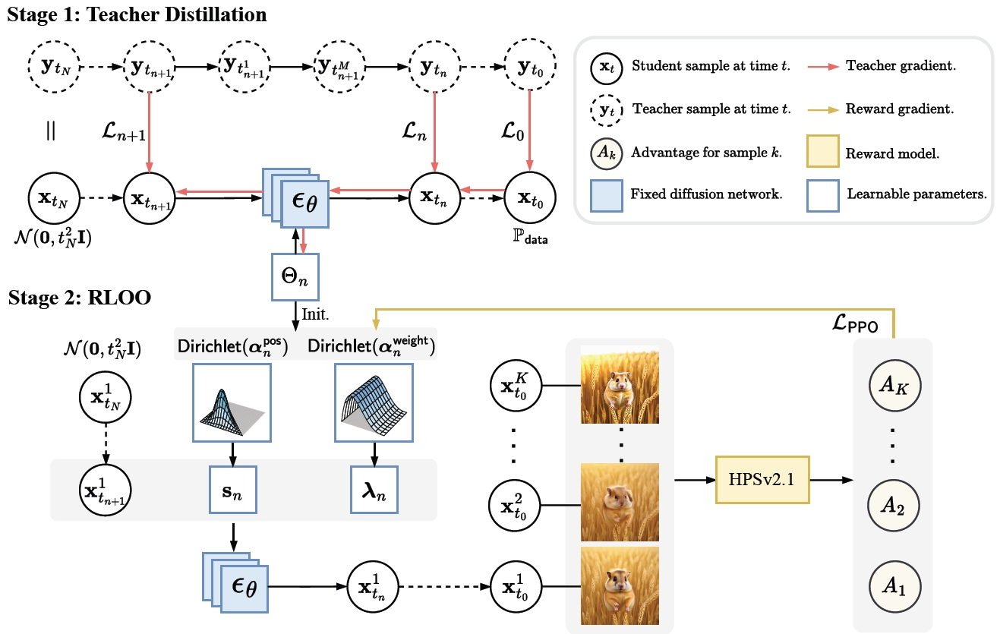
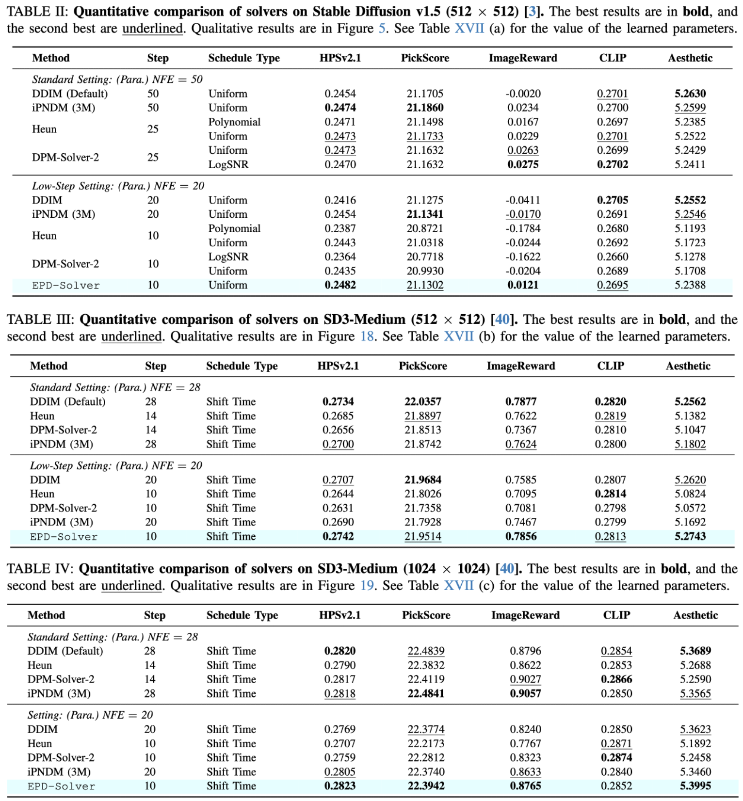

<h1 align="center">
  Parallel Diffusion Solver via<br> Residual Dirichlet Policy Optimization
</h1>
<div align="center">
  <a href='https://arxiv.org'></a>  &nbsp;
  <a href='https://epd-solver.github.io/'></a> &nbsp;
</div>

## Algorithm Overview
<div align="center">

</div>

**EPD-Solver** (Ensemble Parallel Direction) mitigates truncation errors in diffusion sampling by leveraging **parallel gradient evaluations** within a single step. We introduce a novel two-stage optimization framework that aligns the solver with human preferences without fine-tuning the heavy diffusion backbone.

### 1. Parallel Gradient Estimation
Instead of sequential evaluations, EPD-Solver computes gradients at multiple learned intermediate timesteps ($\tau_n^k$) in parallel. By aggregating these gradients via a simplex-weighted sum, it achieves a higher-order approximation of the integral direction with negligible latency overhead on modern GPUs.

### 2. Two-Stage Optimization
* **Stage 1: Distillation-Based Initialization** 
    We first distill a few-step student solver by minimizing the trajectory error against a high-fidelity teacher (e.g., DPM-Solver). This provides a robust initialization that captures the trajectory curvature.

* **Stage 2: Residual Dirichlet Policy Optimization (RDPO)** 
    We reformulate the solver as a **stochastic Dirichlet policy**. Using a lightweight PPO variant, we fine-tune the solver's low-dimensional parameters (time segments and weights) to maximize human-aligned rewards (e.g., HPSv2, ImageReward). This ensures high perceptual quality and semantic alignment even at low NFEs (e.g., 20 steps).

## Installation

1. **Create Environment**
   ```bash
   conda env create -f environment.yml -n epd
   conda activate epd
   ```
2. **Install Dependencies**
    ```bash
    # Core dependencies
    pip install omegaconf gdown lightning fairscale piq accelerator timm einops kornia HPSv2
    pip install --upgrade diffusers[torch]

    # CLIP & Transformers
    pip install git+[https://github.com/openai/CLIP.git](https://github.com/openai/CLIP.git)
    pip install transformers
    pip install -e git+[https://github.com/CompVis/taming-transformers.git@master#egg=taming-transformers](https://github.com/CompVis/taming-transformers.git@master#egg=taming-transformers)
    ```

3. **Setup Environment Variables Important: Run this before training or inference.**

    ```bash
    export PYTHONPATH="$PWD/training/ppo/reward_models/HPSv2:$PWD/src/taming-transformers:$PYTHONPATH"
    ```

## Model Zoo & Checkpoints

We provide pre-trained predictors (**Stage 1: Distilled**) and RL-finetuned solvers (**Stage 2: Best**).
Stage 2 models are optimized using Residual Dirichlet Policy Optimization for better human preference alignment.

| Model | Resolution | Type | Download |
| :--- | :---: | :---: | :---: |
| **Stable Diffusion v1.5** | 512x512 | RL-Best (Stage 2) | [sd15-best.pkl](./exps/sd15/sd15-best.pkl) |
| | | Distilled (Stage 1) | [sd15-distilled.pkl](./exps/sd15/sd15-distilled.pkl) |
| **SD3-Medium** | 1024x1024 | RL-Best (Stage 2) | [sd3-1024-best.pkl](./exps/sd3-1024/sd3-1024-best.pkl) |
| | | Distilled (Stage 1) | [sd3-1024-distilled.pkl](./exps/sd3-1024/sd3-1024-distilled.pkl) |
| **SD3-Medium** | 512x512 | RL-Best (Stage 2) | [sd3-512-best.pkl](./exps/sd3-512/sd3-512-best.pkl) |
| | | Distilled (Stage 1) | [sd3-512-distilled.pkl](./exps/sd3-512/sd3-512-distilled.pkl) |

We also provide a detailed guide for each part below.

### RDPO Training

To train EPD-Solver using RDPO:

```bash
# Available configs: sd15.yaml, sd3_512.yaml, sd3_1024.yaml
torchrun --master_port=12345 --nproc_per_node=1 -m training.ppo.launch \
    --config training/ppo/cfgs/sd3_1024.yaml
```

**Note**: RDPO training was performed using a single NVIDIA H200 GPU. Refer to launch.sh for full scripts.

### Inference
To generate images with an EPD-Solver, use the examples below (replace checkpoint paths with your own exports as needed):

```bash
## SD1.5
MASTER_PORT=12345 python sample.py \
    --predictor_path exps/sd15/sd15-best.pkl \
    --prompt-file src/prompts/test.txt \
    --seeds "0-19" \
    --batch 4 \
    --outdir samples/sd15

## SD3-Medium
python sample_sd3.py --predictor exps/sd3-1024/sd3-1024-best.pkl \
  --seeds "0" \
  --outdir samples/sd3 \
  --prompt "..."
```

### Evaluation

We provide six metrics to evaluate generated images: **HPSv2.1, PickScore, ImageReward, CLIP, Aesthetic, and MPS**. Please refer to the evaluation script section in [launch.sh](./launch.sh).

## Parameter Description

**Sampling (`sample.py`)**

| Parameter | Default | What it controls |
|-----------|---------|------------------|
| `predictor_path` | required | EPD predictor snapshot (.pkl); numeric IDs auto-resolve to the latest matching checkpoint in `./exps`. |
| `model_path` | None | (Reserved) optional backbone checkpoint override; currently unused because backbones auto-resolve from dataset tags. |
| `max_batch_size` (`--batch`) | `64` | Per-process batch size; seeds are split across ranks. |
| `seeds` | `0-63` | Seed list or range; determines how many images are generated. |
| `prompt` | None | Single text prompt for all seeds; if omitted, falls back to `prompt-file` or MS-COCO eval captions for `dataset_name=ms_coco`. |
| `prompt-file` | None | Text or CSV (column `text`) with prompts; used when `prompt` is empty. |
| `backend` | Predictor metadata | Override backbone (`ldm`/`sd3`); defaults to what is stored in the predictor. |
| `backend-config` | None | JSON object overriding backend options (e.g., SD3 resolution/torch_dtype/offload/token). |
| `use_fp16` | `False` | Reserved flag for mixed precision (not currently wired). |
| `return_inters` | `False` | Reserved flag for saving intermediates (not currently wired). |
| `outdir` | Auto (`./samples/{dataset}` or `./samples/grids/{dataset}`) | Output root; falls back to a derived path when unset. |
| `grid` | `False` | Save a grid per batch instead of per-image files. |
| `subdirs` | `True` | When saving per-image files, create 1k-chunked subfolders. |

**Sampling (`sample_sd3.py`)**

| Parameter | Default | What it controls |
|-----------|---------|------------------|
| `predictor` | required | SD3 EPD predictor snapshot (.pkl). |
| `seeds` | `0-3` | Seed list or range; determines how many images are generated. |
| `prompt` | None | Single prompt for all seeds; if empty, uses `prompt-file` or falls back to empty prompts. |
| `prompt-file` | None | Text/CSV file with prompts; repeats to match `seeds` length. |
| `outdir` | `./samples/sd3_epd` | Output directory. |
| `grid` | `False` | Save a grid per batch. |
| `max-batch-size` | `4` | Per-batch sample count (`--max-batch-size`). |
| `resolution` | Predictor/back-end config (512 or 1024) | Optional override; must match predictor metadata if set. |

**Solver metadata (read from predictor checkpoints)**

| Parameter | Default source | Notes |
|-----------|----------------|-------|
| `dataset_name` | Predictor ckpt | Dataset tag (e.g., `ms_coco`); drives prompt fallback and output paths. |
| `backend` / `backend_config` | Predictor ckpt | Backbone type plus stored options (resolution, flow-match params, offload/token settings for SD3, etc.). |
| `num_steps` | Predictor ckpt | Inference steps; base NFE `2*(num_steps-1)` (minus one eval when `afs=True`, doubled again for CFG in ms_coco). |
| `num_points` | Predictor ckpt | Number of intermediate points per step; used for NFE reporting/outdir naming. |
| `guidance_type` / `guidance_rate` | Predictor ckpt | CFG sampling (e.g., 4.5 for SD3 PPO configs, 7.5 for SD1.5). |
| `schedule_type` / `schedule_rho` | Predictor ckpt | `flowmatch` for SD3, `discrete` for SD1.5. |
| `sigma_min` / `sigma_max` | Predictor or backend | Noise range passed to scheduler (falls back to backend defaults when unset). |
| `flowmatch_mu` / `flowmatch_shift` | Predictor or backend | Flow-matching parameters used by SD3 schedules. |
| `afs`, `max_order`, `predict_x0`, `lower_order_final` | Predictor ckpt | EPD/DPM solver behavior flags. |

**RDPO Training configs (`training/ppo/cfgs/*.yaml`)**

| Key | sd3_512 | sd3_1024 | sd15 | Purpose |
|-----|---------|----------|------|---------|
| `data.predictor_snapshot` | `exps/sd3-512/...-distilled.pkl` | `exps/sd3-1024/...-distilled.pkl` | `exps/sd15/...-distilled.pkl` | Starting EPD predictor. |
| `model.backend` | `sd3` | `sd3` | `ldm` | Backbone family used during RL. |
| `model.resolution` | `512` | `1024` | n/a | SD3 training resolution (LDM inherits from predictor/backbone). |
| `model.schedule_type` | `flowmatch` | `flowmatch` | `discrete` | Diffusion schedule during RL. |
| `model.guidance_rate` | `4.5` | `4.5` | `7.5` | CFG scale used while training the solver. |
| `ppo.rollout_batch_size` | `16` | `8` | `8` | Samples per PPO rollout. |
| `ppo.dirichlet_concentration` | `10` | `10` | `20` | Dirichlet policy concentration. |
| `reward.batch_size` | `4` | `4` | `4` | Reward evaluation batch size. |
| `reward.multi.weights` | `hps:1.0` (others 0) | same | same | Per-head reward weights. |

Shared defaults across configs: `model.dataset_name=ms_coco`, `model.guidance_type=cfg`, `model.schedule_rho=1.0`, `model.num_steps/num_points/sigma_min/sigma_max` left `null` to inherit predictors/backends, `reward.type=multi`, `reward.enable_amp=true`, `reward.weights_path=weights/HPS_v2.1_compressed.pt`, `ppo.learning_rate=7e-5`, `ppo.minibatch_size=4`, `ppo.ppo_epochs=1`, `ppo.rloo_k=4`, `ppo.clip_range=0.2`, `ppo.kl_coef=0.0`, `ppo.entropy_coef=0.0`, `ppo.max_grad_norm=1.0`, `ppo.decode_rgb=true`, `ppo.steps=99999`, `logging.log_interval=1`, `logging.save_interval=500`, `run.output_root=exps`, `run.seed=0`.

## Performance Highlights

<div align="center">

</div>

## Citation
If you find this repository useful, please consider citing the following paper:

```

```
